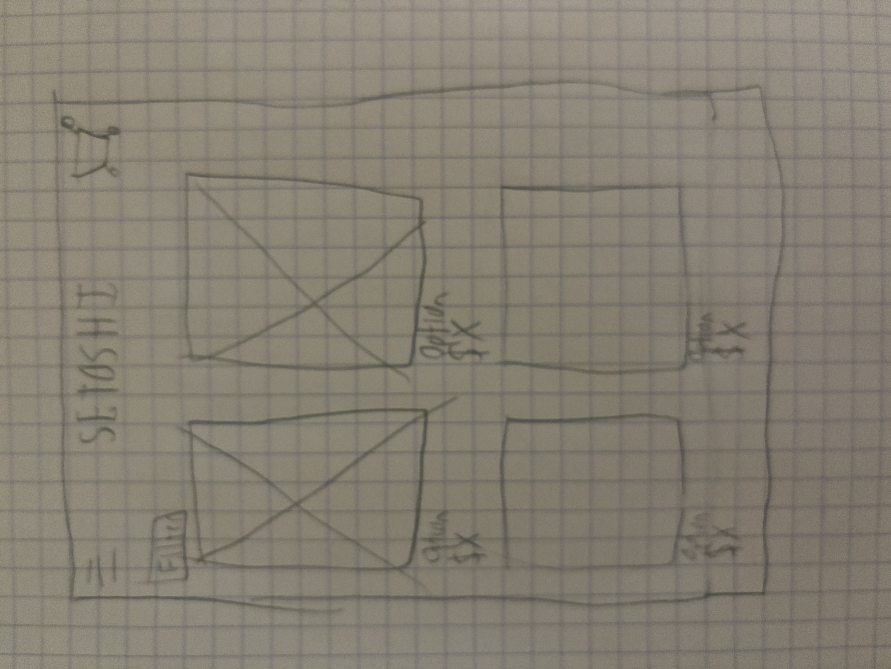

# Pelletier-4630-Project1
 
## Milestone 1: Process Log

The purpose of this website (Setoshi) is to present an online clothing store with cart and filter functionality. I was inspired by online stores like Levi's, Supreme, Aeropostale, and other similar stores. My audience will be for people who have a desire to look their best and improve their wardrobe/fits.

I have already made the homepage of the site, but I want to develop pages where you can see the catalog of different clothing options, along with a cart and filter option. This is my plan for what I want the site to look like: 

This is the homepage that I have so far: https://codepen.io/joey1pelletier/pen/poNYdyx

I intend to use Javascript to allow users to filter clothing options, and also them to keep a record of adding things to cart. I can also use a content management system to lower down the hard-coding process as well.

I intend to use the Web Storage API so my website can store values of filters and things for their shopping cart. I will also look into any libraries that can streamline the project process and add more functionality to my online store.

In terms of information sources, I can use ChatGPT to generate models wearing clothing options. I can also look into sites like Pexels to find stock images of clothes.

The website will be responsive by having a mobile-first approach during development. This allows for an easy transition to desktop mode, rather than painfully going from desktop to mobile. This will be done with various amounts of media queries that will adapt to different screen sizes.

Below are my goals:
    Prototyping: Sketches and Figma mock-ups will allow me to visualize my page before development, and also help me keep track of each section I'm developing.

    Minimum Viable Product: An online clothing store with clothing options (most likely not as big as an actual store), a filter feature (will most likely be basic and not in depth), and a cart feature with add and remove.

    Stretch Goals: Add more in-depth filter options, increase the store catalog, and/or add a 'fake' enter payment page.

## Milestone 2

I got sick with strep and was bedridden for over a week, so my progress wasn't substantial (loooottts of work to do over the weekend b/c of that). I was able to transfer my codepen.io code into VS Code and the GitHub project repo. On October 17th, I'll do more work on the Figma prototype, and figure out how to implement vite.js and a content management system. The current Figma prototype is presented below.

This vercel deployment link shows my initial project with the website (so far, just the code I transferred from codepen): https://pelletier-4630-project1-milestone2-qdzoq8iib.vercel.app/