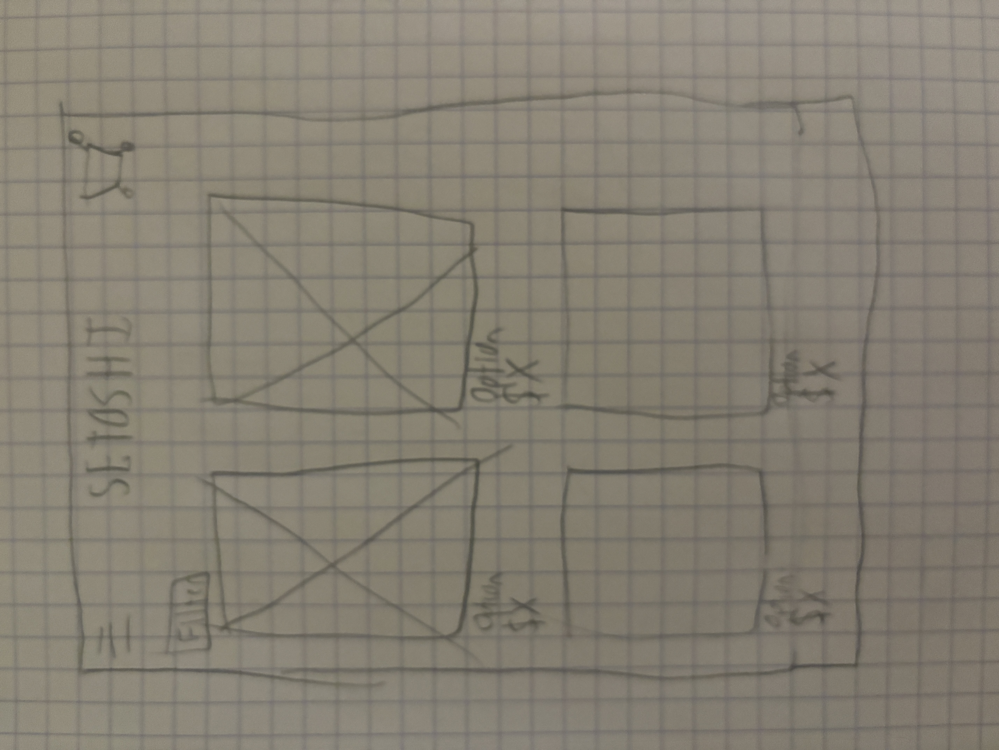
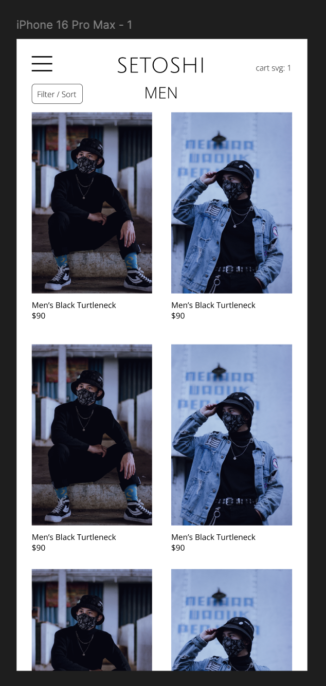

# Pelletier-4630-Project1
 
## Milestone 1: Process Log

The purpose of this website (Setoshi) is to present an online clothing store with cart and filter functionality. I was inspired by online stores like Levi's, Supreme, Aeropostale, and other similar stores. My audience will be for people who have a desire to look their best and improve their wardrobe/fits.

I have already made the homepage of the site, but I want to develop pages where you can see the catalog of different clothing options, along with a cart and filter option. This is my plan for what I want the site to look like: 

This is the homepage that I have so far: https://codepen.io/joey1pelletier/pen/poNYdyx

I intend to use Javascript to allow users to filter clothing options, and also them to keep a record of adding things to cart. I can also use a content management system to lower down the hard-coding process as well.

I intend to use the Web Storage API so my website can store values of filters and things for their shopping cart. I will also look into any libraries that can streamline the project process and add more functionality to my online store.

In terms of information sources, I can use ChatGPT to generate models wearing clothing options. I can also look into sites like Pexels to find stock images of clothes.

The website will be responsive by having a mobile-first approach during development. This allows for an easy transition to desktop mode, rather than painfully going from desktop to mobile. This will be done with various amounts of media queries that will adapt to different screen sizes.

Below are my goals:
    Prototyping: Sketches and Figma mock-ups will allow me to visualize my page before development, and also help me keep track of each section I'm developing.

    Minimum Viable Product: An online clothing store with clothing options (most likely not as big as an actual store), a filter feature (will most likely be basic and not in depth), and a cart feature with add and remove.

    Stretch Goals: Add more in-depth filter options, increase the store catalog, and/or add a 'fake' enter payment page.

## Milestone 2

I got sick with strep and was bedridden for over a week, so my progress wasn't substantial (loooottts of work to do over the weekend b/c of that). I was able to transfer my codepen.io code into VS Code and the GitHub project repo. On October 17th, I'll do more work on the Figma prototype, and figure out how to implement vite.js and a content management system. The current Figma prototype is presented below.

This vercel deployment link shows my initial project with the website (so far, just the code I transferred from codepen): pelletier-4630-project1-milestone2.vercel.app

## Milestone 4

My creative approach to this project was to apply the same design of the home page to the new arrivals page. However, one obstacle I ran into was my messy css application to the home page 3 years ago. That page looked fine and responsive enough, but there were so many padding and margin "band-aid" fixes to the point where adding the new shopping cart icon required a nav-bar rework. 

My technical approach to this process was to create a shopping cart feature to my website. I knew this could be done with an array of item objects inside of a cart. Each item needed to have it's image, label, price, and index number (required for proper splice functionality). Newly added items will be pushed into the cart array, whereas removed items are removed via the splice function in order to keep the cart array consistent (for example, removing the number 3 from an array with 1,2,3,4 will result in an array with 1,2,4, and the order and array length stay the same). As an extra UI feature, cart items will show up on a pop-up cart box and can be removed as needed. As the user interacts with the cart, the Web Storage API's localStorage will store the cart and DOM data. That way, whenever the user refreshes/reopens the page, their cart will stay the same as it was previously.

Due to strep throat knocking me out for over a week, I wasn't able to accomplish my intended goals of combining a CMS with the Web Storage API, along with the creation of a filter feature. Therefore I had to reduce my MVP to a Web Storage API cart page.

One JS obstacle I ran into was having certain pieces of DOM data not being saved to localStorage whenever the page has reopened. The remove item event listeners were non-functional, and the page would be stuck with the previous data that couldn't be removed. After doing some research, I realized that my initial way of adding things to the DOM (in this case, the web dev sin of .innerHTML usage) could not hold data in localStorage after a page reload. Instead, I had to create a new addItemToDOM function that used createElement and appendChild functions to properly add items and HTML to the DOM. With this strategy, the event listeners stayed put and allowed the cart to function properly.

Another CSS obstacle I ran into was having plus signs on an item image not showing up. At that time, I did not realize that setting the plus sign's position to 'absolute' affected their position on the whole webpage rather than on it's parent function (i.e. having the position set to 'relative'). Instead, I took the easy way out and just added "Add to Cart" text below each item.

Overall, with this project I was able to improve my skills with vanilla JS and successfully apply the Web Storage API to it. For future projects, I will definitely consider using this API again to keep user data in-tact after any page reloads. Also, I feel more confident with creating functional and visually appealing page pop-ups. At this point, I should have most of the tools required for an online store website, hence I can expand on this project with additional pages and filter options.

